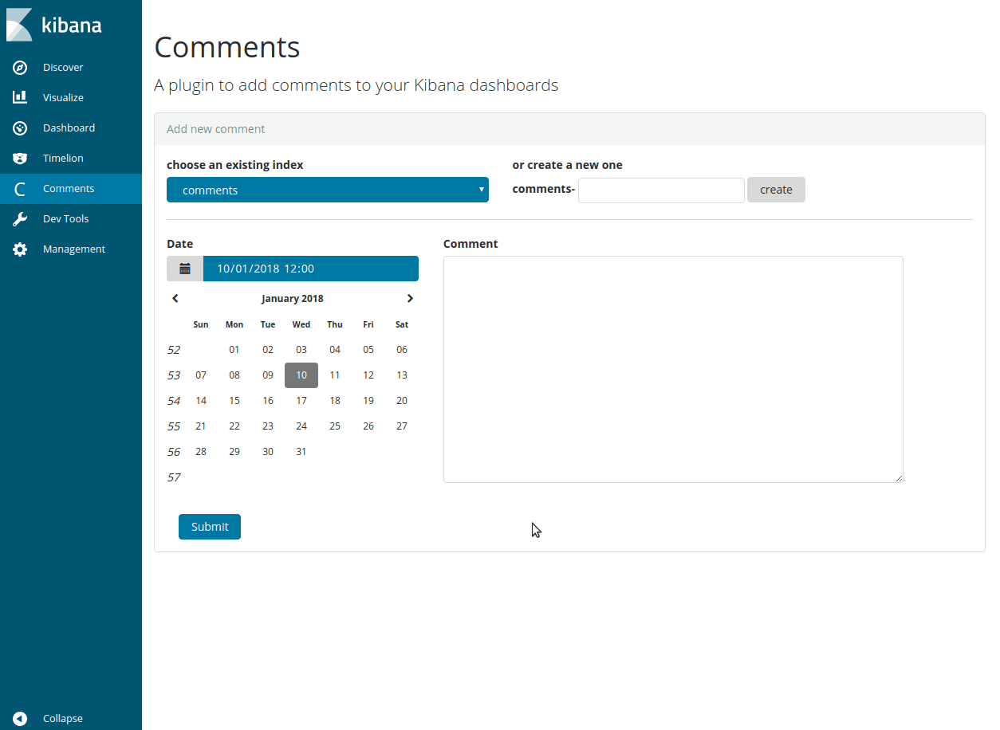
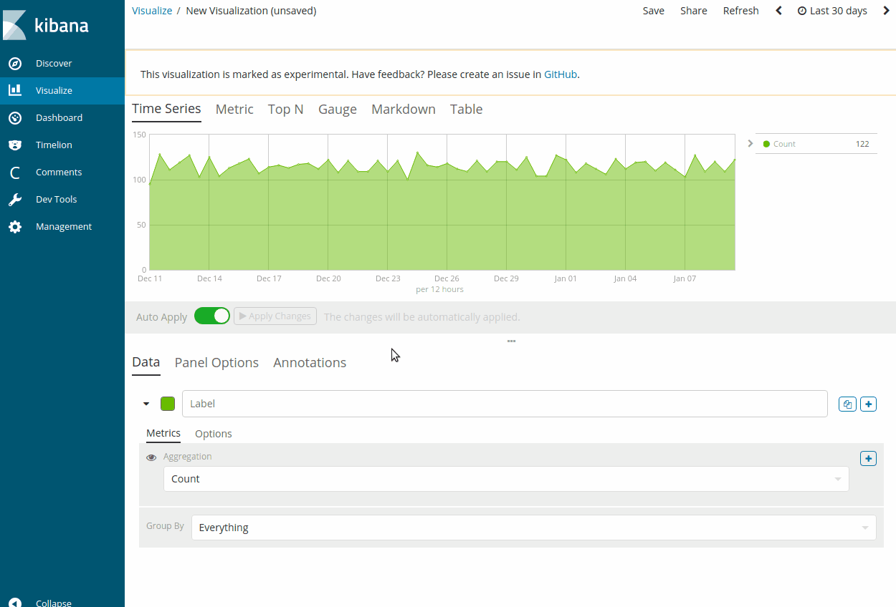

# kibana-comments-app-plugin

> An application plugin to add and visualize comments to your Kibana dashboards

---

## demo

### How to... add new comments



### How to... view comments with annotations feature

**Annotations are only available in `Visual Builder` visualization type**



## configuration 


Set the number of shards and replicas for new comment's indices
Edit your kibana.yml
```
kibana-comments-app-plugin.newIndexNumberOfShards: 1
kibana-comments-app-plugin.newIndexNumberOfReplicas: 1
```


## development

This plugin is bootstrapped from [template-kibana-plugin](https://github.com/elastic/template-kibana-plugin)

See the [kibana contributing guide](https://github.com/elastic/kibana/blob/master/CONTRIBUTING.md) for instructions setting up your development environment. Once you have completed that, use the following npm tasks.

  - `npm start`

    Start kibana and have it include this plugin

  - `npm start -- --config kibana.yml`

    You can pass any argument that you would normally send to `bin/kibana` by putting them after `--` when running `npm start`

  - `npm run build`

    Build a distributable archive

  - `npm run test:browser`

    Run the browser tests in a real web browser

  - `npm run test:server`

    Run the server tests using mocha

For more information about any of these commands run `npm run ${task} -- --help`.
